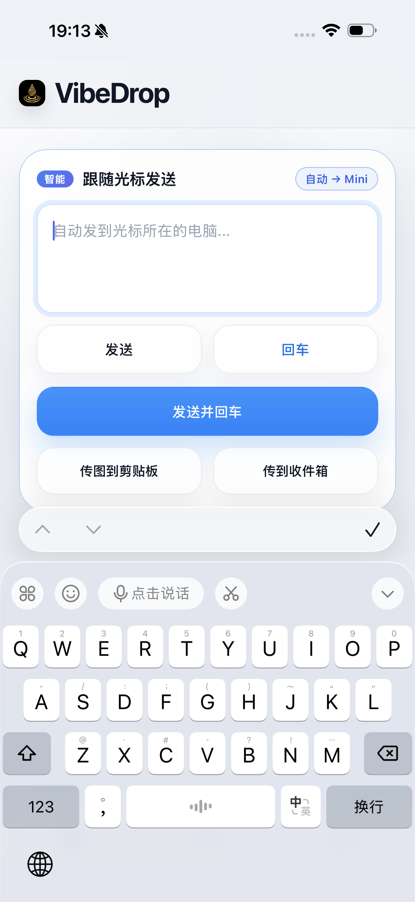

[简体中文](README.md) | [繁體中文](README.zh-TW.md) | [English](README.en.md) | [日本語](README.ja.md) | [한국어](README.ko.md) | [Español](README.es.md) | [Français](README.fr.md) | [Deutsch](README.de.md) | [Русский](README.ru.md) | [Kiswahili](README.sw.md) | [Runasimi](README.qu.md)

<div align="center">


# VibeDrop

**Zana ya kusawazisha ubao nakili na kuhamisha maandishi na faili kati ya simu na Mac — muunganisho wa moja kwa moja kwenye mtandao wa ndani, bila kutegemea wingu**

[](https://github.com/jncdke/VibeDrop/releases)
[](LICENSE)


[Pakua Release](https://github.com/jncdke/VibeDrop/releases) · [Vipengele](#vipengele) · [Uchambuzi wa ujumbe](#uchambuzi-wa-ujumbe-na-ripoti-ya-marudio-ya-maneno)

</div>

---

VibeDrop ina sehemu tatu zinazowasiliana moja kwa moja kupitia **WebSocket** kwenye mtandao wa ndani, bila kuhitaji Intaneti wala huduma ya wingu:

- **App ya Mac** (`desktop/`) — hupokea maandishi na faili, hutangaza ubao nakili na kukaa kwenye trei ya mfumo
- **App ya simu** (`mobile/`, Android + iOS) — hutuma maandishi, picha, video na faili, na kuonyesha ratiba ya Historia
- **Home Vault** (`scripts/`) — seva ya nyumbani ya kuunganisha historia za vifaa, kuhifadhi midia asili na kukusanya kumbukumbu za uchunguzi

---

## Picha za skrini

**Kadi mahiri ya kutuma “Tuma kufuata kishale”**——zungumza na simu, maandishi yaingie moja kwa moja kwenye kompyuta iliyo na kishale (kwa matumizi ya Universal Control):

<div align="center">
<table>
  <tr>
    <td align="center" colspan="2"><br><sub>App ya macOS — muhtasari wa vifaa · kuoanisha · buruta kutuma</sub></td>
  </tr>
  <tr>
    <td align="center"><br><sub>iOS (iPhone 17 Pro Max)</sub></td>
    <td align="center"><br><sub>Android (OnePlus Ace 5)</sub></td>
  </tr>
</table>
</div>

---

## Vipengele

| Kipengele | Mac | Simu (Android + iOS) |
|------|--------|------------------------|
| 🎯 Kadi mahiri ya kutuma “Tuma kufuata kishale” | ✅ Huripoti shughuli ya kibodi na kipanya (`CGEventSource`, bila ruhusa) | ✅ Hutuma maandishi/picha/faili kwa Mac iliyo na kishale, hufuata ndani ya sekunde 1 na huruhusu kubadili mwenyewe |
| 📝 Uhamisho wa maandishi (simu → Mac) | ✅ Hupokea na kuiga uingizaji wa kibodi | ✅ Huhifadhi kibodi na uingizaji wa sauti baada ya kutuma ili kuendelea kuamuru bila hatua za ziada |
| 📋 Usawazishaji wa ubao nakili (Mac → simu) | ✅ Hufuatilia mabadiliko na kuyatangaza | ✅ Huduma asilia ya usuli huandika kwenye ubao nakili |
| 🌍 Lugha | ✅ Fuata mfumo | ✅ Lugha 11 (Kichina rahisi/cha jadi, Kiingereza, Kijapani, Kikorea, Kihispania, Kifaransa, Kijerumani, Kirusi, Kiswahili na Runasimi), mtindo wa gettext hurudi Kichina tafsiri ikikosekana |
| 🤝 Ugunduzi na uoanishaji otomatiki | ✅ Huonyesha maombi yanayosubiri na vifaa vilivyounganishwa | ✅ Hutafuta Kompyuta za karibu na kuoanisha kwa msimbo; kifaa kinaweza kubadilishwa jina na kusawazishwa kati ya simu |
| 📜 Ratiba ya Historia | ✅ Mwonekano wa vifaa vyote + vijipicha | ✅ Huunganisha vifaa vyote, huchuja kwa chanzo/lengo/aina/asili/wakati na kuangazia utafutaji |
| 📈 Ramani ya shughuli | ✅ Ramani ya kupokea + chuja kwa kugusa kisanduku | ✅ Ramani ya kutuma + chuja kwa kugusa kisanduku |
| 🔬 Uchambuzi wa ujumbe | — (Home Vault hutengeneza ripoti) | ✅ Ripoti kamili ndani ya Historia: wingu la maneno/misemo/grafu ya nguzo ya mwenendo wa kutuma, buruta kuona maelezo |
| 📁 Uhamisho wa faili pande mbili | ✅ Buruta na udondoshe / huduma za Finder / kushiriki kwa Finder | ✅ Tuma kwa Kikasha / picha huenda Albamu, mafungu hufungwa kiotomatiki |
| 🗄 Home Vault | Seva ya nyumbani: kuunganisha historia za vifaa · hifadhi ya midia asili (kuondoa nakala kwa hashi + utiririshaji wa Range) · kukusanya kumbukumbu za uchunguzi | ✅ Kutuma ongezeko + usawazishaji wa SSE wa moja kwa moja |
| 🔒 Uthibitishaji wa PIN | ✅ Hutengenezwa bila mpangilio na kuhifadhiwa kwenye faili | ✅ Huhifadhiwa baada ya kuoanisha kwa msimbo |
| 🕰 Saa ya kuonyesha | ✅ Saa za hapa/Beijing/Pasifiki, kipimo kimoja cha kuonyesha na takwimu | — |
| 📡 Kudumu mbele / trei | ✅ Trei ya mfumo + kuanza wakati wa kuingia | ✅ Arifa ya Android inayodumu |

---

## Muhtasari wa usanifu wa kiufundi

```
        ┌────────────────────────────┐      ┌────────────────────────────┐
        │   Mac 桌面端 × N (Tauri 2) │      │  手机端 × N (Tauri 2 Mobile)│
        │  ├ Axum HTTP/WS :9001      │◄────►│  ├ app.js  单文件前端       │
        │  ├ enigo 键盘模拟          │  WS  │  ├ lib.rs  16 个原生命令    │
        │  ├ arboard 剪贴板监听      │      │  ├ Kotlin  保活/播放器/剪贴板│
        │  ├ CGEventSource 活动上报  │      │  └ iOS     滚动锁(KVO)      │
        │  └ UDP/HTTP 发现应答       │      └──────────────┬─────────────┘
        └──────────────┬─────────────┘                     │
                       │              HTTP :8788           │
                       ▼                                   ▼
        ┌──────────────────────────────────────────────────────────┐
        │        Home Vault (家庭服务器, home-vault-receiver.py)     │
        │  跨设备历史合并 · 媒体原件仓(哈希去重+Range) · SSE 广播     │
        │  设备名公告板 · 探针日志回收 · 自我研究报告(SWR)            │
        └──────────────────────────────────────────────────────────┘
```

Njia tatu za mawasiliano, zote zikiwa za moja kwa moja kwenye mtandao wa ndani bila wingu:

1. **Simu ↔ Mac**: WebSocket (`:9001/ws`), hutuma maandishi, faili, ubao nakili na hoja za shughuli baada ya PIN kuthibitishwa;
2. **Vifaa vyote → Home Vault**: HTTP (`:8788`), hutuma nyongeza za Historia na midia na kuchukua ripoti;
3. **Vault → viteja**: muunganisho wa kudumu wa SSE (`/api/events`), hutangaza baada ya kuhifadhi na kutuma mpigo kila sekunde 25.

---

## Maelezo ya michakato mikuu

### Kadi mahiri ya kutuma “Tuma kufuata kishale”

1. App ya Mac ikipokea `activity_query`, huita `CGEventSourceSecondsSinceLastEventType`
   kujibu “sekunde ngapi tangu shughuli ya mwisho ya kibodi au kipanya” (hakuna ruhusa wala uzi—husoma daftari ambalo mfumo tayari hutunza kwa kihifadhi skrini);
2. Simu huuliza kila Mac iliyounganishwa kila sekunde na kulinganisha **sekunde zao za kutofanya kazi kwa uwiano** (tofauti ya saa za kompyuta haiathiri).
   Mac yenye shughuli mpya zaidi ndiyo iliyo na kishale: Universal Control hupeleka matukio halisi ya kibodi na kipanya kwenye kompyuta hiyo, hivyo ishara inalingana moja kwa moja na hali halisi;
3. Lengo hufungwa wakati wa kutuma maandishi, picha au faili; gusa kiashiria kubadili kati ya otomatiki na mwenyewe.

### Ugunduzi na uoanishaji

Simu hutafuta kwa njia mbili kwa pamoja: tangazo la UDP + uchunguzi wa HTTP (`discover_desktops`). Ikipata App ya Mac, huanza kuoanisha kwa msimbo (Mac huonyesha kadi ya kuthibitisha na pande zote hulinganisha msimbo); ikikubaliwa, kifaa huhifadhiwa na kuunganishwa kiotomatiki.
Jina maalum la kifaa likihifadhiwa, ubao wa matangazo wa Vault (`/api/device-names`, serverId kama ufunguo, LWW) hulisawazisha kati ya simu.

### Maandishi na faili

- Maandishi: vitendo `type` / `type_enter` huifanya App ya Mac kuiga kibodi kwa enigo; Hali ya mbali hutumia
  `clipboard_text` badala yake (huandika ubao nakili tu, kwa zana za udhibiti wa mbali kama UU Remote);
- Faili: itifaki ya vipande (begin/append/finish/cancel). Kwenye simu huenda Kikasha au Albamu,
  na kwenye Mac hutumwa kwa kuburuta/huduma ya Finder. Njia yote ina namba `transferId`, hivyo rekodi za kutuma na kupokea huunganishwa kwa usahihi;
- Vitufe vya kutuma havichukui fokasi (mousedown preventDefault): kibodi na kipindi cha sauti hubaki baada ya kutuma,
  hivyo unaweza kuendelea kuamuru bila hatua za ziada.

### Usawazishaji wa Historia (ongezeko + moja kwa moja)

- Kila kifaa kina Historia ya hapa + kishale cha kutuma (`lastPushedEntryId`) na hutuma ongezeko tu (kipimo: ms 3/188 B kwa rekodi);
- Vault huunganisha ratiba ya vifaa vyote (`/api/history/merged`). Kawaida viteja huchukua rekodi 2,000 kwa urahisi na mara moja kwa kipindi huchukua 10,000 kwa kina; tukio la SSE husasisha mara moja;
- Vitambulisho vyenye jina moja huunganishwa kiotomatiki (ID mpya ya nasibu baada ya kusakinisha upya, “maisha ya awali”, huingizwa kwenye kitambulisho cha hapa); jina ni la kuonyesha, utambulisho hutegemea alama ya kipekee.

### Hifadhi ya midia asili

Asili huhifadhiwa kwa SHA-256 (`/api/media/upload`, utiririshaji + kuondoa nakala, kikomo cha GB 2). Kifaa chochote huchukua asili mtandaoni kwa hashi (`/api/media/blob/<hash>`, utiririshaji wa Range) — “imepotea hapa ≠ imepotea kila mahali”.

### Uchunguzi wa kujikagua wakati wa kuanza (kisanduku cheusi)

Mwanzo wa `app.js` huweka ukamataji wa window.onerror na alama za probe(). Sekunde 6 baada ya kuanza au sekunde 1.5 baada ya hitilafu, hutuma POST kwa Vault `/api/client-log` na kuhifadhi kwa kifaa. Usikisie chanzo cha skrini nyeusi/nyeupe kwenye kifaa halisi; soma kumbukumbu.

---

## Ramani ya msimbo

### App ya Mac `desktop/`

| Faili | Mistari | Jukumu |
|------|------|------|
| `src-tauri/src/main.rs` | ~4900 | Seva ya HTTP/WS, uthibitishaji wa PIN, kibodi ya enigo, ubao nakili wa arboard, kutuma/kupokea faili, trei, majibu ya ugunduzi na ripoti ya shughuli |
| `src/main.js` | ~2600 | UI ya Mac: vifaa, uthibitishaji wa uoanishaji, Historia iliyounganishwa + vijipicha, ramani ya kupokea, saa na kutuma kwa kuburuta |
| `src/style.css` | ~2000 | Mitindo ya Mac |
| `static/*` | — | Nakala sawa kwa baiti ya `mobile/src/` (lazima inakiliwe baada ya mabadiliko ya simu; tazama sehemu ya kujenga) |

### App ya simu `mobile/` (msimbo mmoja kwa Android + iOS)

| Faili | Mistari | Jukumu |
|------|------|------|
| `src/app.js` | ~11500 | Mantiki yote ya mbele: Kadi mahiri ya kutuma, vifaa vingi, Historia (vichujio/uangaziaji wa utafutaji/uskrolaji pepe), ramani, usawazishaji wa Vault, kitazamaji cha midia na uchunguzi |
| `src/i18n.js` | ~110 | Mfumo wa lugha nyingi wa gettext: t()/kurudi/uingizaji/utambuzi wa lugha/akiba ya kamusi |
| `src/locales/*.json` | ×10 | Pakiti za lugha (maandishi ya Kichina ndiyo ufunguo; lugha mpya = faili moja mpya) |
| `src-tauri/src/lib.rs` | ~1900 | Amri 16 asilia: kuhifadhi Historia, kupokea faili kwa vipande, ugunduzi na uoanishaji, kutambua modeli, kupakia midia Vault na kutatua njia; kufunga uskrolaji wa iOS (KVO huangalia contentOffset na kuirudisha kabla ya kuchora) |
| `gen/android/.../MainActivity.kt` | — | Kusambaza console (VibeDropConsole) + kukabidhi WebChromeClient ya awali (kichagua faili n.k.) |
| `gen/android/.../KeepAliveService.kt` | — | Kudumu mbele |
| `gen/android/.../VideoPlayerActivity.kt` | — | ExoPlayer (Media3) asilia ya skrini nzima |
| `gen/android/.../BackgroundClipboardSyncManager.kt` | — | Kuandika ubao nakili asilia usulini |

### Home Vault na zana `scripts/`

| Skripti | Jukumu |
|------|------|
| `home-vault-receiver.py` (~mistari 1000) | Endpoint zote za seva ya nyumbani (tazama jedwali); hudumu kwa launchd |
| `message-self-study.py` | Uchambuzi kamili wa data kwa jieba → ripoti huru ya HTML (pamoja na grafu ya nguzo ya mwenendo wa kutuma) |
| `vault-media-uploader.py` / `sync-home-vault.py` | Kuongeza midia iliyopo / kusawazisha Historia iliyohifadhiwa |
| `i18n-check.py` | Lango la ubora wa lugha: hutafuta funguo zote za t()/data-i18n na kuripoti yaliyokosekana au kuzidi kwenye pakiti |
| `deploy-android.sh` / `deploy-desktop.sh` / `deploy-ios.sh` | Kujenga na kusambaza majukwaa yote matatu kwa amri moja |
| `generate-app-icons.py` / `generate-tray-frames.py` | Kutengeneza mali za chapa |

### Orodha ya haraka ya endpoint za Home Vault

| Endpoint | Kazi |
|------|------|
| `POST /api/history/append` · `GET /api/history/merged` | Kuingiza ongezeko / ratiba iliyounganishwa |
| `GET /api/events` | SSE: hutangaza mara tu baada ya kuhifadhi |
| `POST /api/media/upload` · `/lookup` · `GET /api/media/blob/<hash>` | Hifadhi ya midia: kuingiza bila nakala/kutafuta/kuchukua kwa utiririshaji wa Range |
| `GET/POST /api/device-names` | Ubao wa majina ya vifaa (LWW) |
| `POST /api/client-log` | Kukusanya kisanduku cheusi cha uchunguzi |
| `GET /report/self-study` | Ripoti ya uchambuzi (SWR: akiba hufunguka papo hapo, huhesabiwa upya usulini ikiisha, `?refresh=1` hulazimisha kusasisha) |

---

## Mafunzo ya vitendo kwa kila jukwaa

### Tofauti za injini za WebView (muhimu)

| | Android | iOS | Mac |
|---|---------|-----|-----------|
| Injini | Chromium | **WKWebView** | **WKWebView (sawa na iOS!)** |
| `content-visibility: auto` | ✅ Upepeo asilia | ❌ Skrini nyeusi | ❌ Nafasi tupu wakati wa kusogeza |
| Mkakati wa orodha ndefu | content-visibility | Uskrolaji pepe wa JS | Kupachika kwa vipande |
| Kutenganisha maneno ya Kichina kwa `Intl.Segmenter` | ❌ Hugawanya herufi moja moja | ✅ Kamusi kamili | ✅ |

**Hitimisho: kutenganisha Kichina kati ya injini lazima kutumia jieba ya seva; content-visibility inaruhusiwa kwenye Android pekee.**

### iOS

- **Mpangilio usiohamishika**: uskrolaji wa WKWebView ya nje umezimwa na muundo wa ganda la App (`isScrollEnabled=false` huzuia ishara tu;
  WebKit huonyesha kibodi kwa kusogeza kwa programu, hivyo lazima pia **KVO iangalie contentOffset na kuirudisha kabla ya kuchora**;
  “asili” inayofungwa ni nafasi ya utulivu ya mfumo `-adjustedContentInset`, si (0,0)); weka kufuli upya kila App ikirudi mbele;
- Sheria ya kifurushi: `cargo tauri ios build --export-method debugging`, usitumie Xcode Run moja kwa moja;
- Sahihi ya bure hudumu siku 7 tangu kutengenezwa na inahitaji mtiririko wa kusaini upya kiotomatiki.

### Android

- WebChromeClient maalum **lazima ikabidhi kwa client ya awali** (onShowFileChooser n.k.); kuibadilisha yote huzima kichagua faili;
- Console halisi inaonekana kwa `adb logcat -d VibeDropConsole:I "*:S"`;
- Hitilafu tano za “Cannot redefine property” wakati wa kuanza ni kelele salama kutoka skripti ya Tauri kuendeshwa mara mbili; usizichunguze.

### Mac

- Uigaji wa kibodi wa enigo huenda kwenye uzi wake; ubao nakili huulizwa kila ms 500 → broadcast channel → kila muunganisho wa WS;
- Jina la ndani la programu ya Mac bado ni `voicedrop` (kumbuka ukitumia pgrep).

---

## Lugha (i18n)

Mradi hutumia mtindo wa gettext: **maandishi asili ya Kichina ndiyo ufunguo**. `t('发送并回车')` hutafuta kamusi ya lugha ya sasa na tafsiri ikikosekana hurudi Kichina (tafsiri ya sehemu inaweza kutolewa wakati wowote). Vigezo hutumia nafasi kama `t('已改名为 {name}', {name})`; kuunganisha mifuatano kumekatazwa.
Sasa kuna lugha 11. Lugha mpya = faili moja `locales/<lang>.json` + mstari mmoja kwenye jedwali la `i18n.js`.

- Lango la ubora: `python3 scripts/i18n-check.py --strict` (ufunikaji wa funguo/ukamilifu wa nafasi);
- Ukaguzi wa maana: soma kwa mkono maneno 30 ya msingi kwa kila lugha (mashine haiwezi kuhakikisha maana; tazama `docs/i18n-规范.md`);
- Kichagua lugha hutumia **jina la lugha lenyewe** pamoja na mwongozo wa matamshi wa Kichina na Kiingereza; hakuna pakiti inayoyatafsiri.

---

## Kujenga na kusambaza

```bash
# Android(需 cargo + Android SDK 于 PATH)
./scripts/deploy-android.sh          # 构建签名 APK + adb 安装启动

# macOS 桌面端
./scripts/deploy-desktop.sh          # 构建 + 本地自签 + 装入 /Applications
#   --skip-build --skip-icons        # 复用现成产物只重装(异机编译后拷贝场景)

# iOS(必须走 Tauri 管线)
cd mobile/src-tauri && cargo tauri ios build --export-method debugging
xcrun devicectl device install app --device <UDID> gen/apple/build/arm64/VibeDrop.ipa
```

**Kanuni mbili**:

1. Baada ya kubadili app.js / index.html / style.css / i18n.js / locales/ ndani ya `mobile/src/`,
   **lazima unakili kwenye `desktop/static/`** (toleo la kivinjari cha simu linalotolewa na HTTP ya Mac);
2. **Ujenzi wa Tauri mara mbili hauwezi kwenda sambamba** (hutumia njia moja ya IPC na hugongana); uendeshe kwa mfuatano.

---

## Matoleo ya GitHub

Kutuma lebo ya `v*` huanzisha `release.yml`: hujenga APK iliyosainiwa + dmg ya macOS na kuchapisha GitHub Release;
`ci.yml` huendesha ukaguzi wa ujenzi na majaribio ya Python kila push.

```bash
git tag -a v0.x.y -m "说明" && git push origin v0.x.y
```

---

## Uchambuzi wa ujumbe na ripoti ya marudio ya maneno

Changanua data yako mwenyewe ya Historia ya Home Vault: mgawanyo na marudio ya maneno, misemo, virai vinavyorudiwa, mabadiliko ya mada kwa mwezi (TF-IDF) na mwenendo wa kutuma (grafu za nguzo kwa saa/siku, buruta kwa kidole kuona maelezo). Ripoti huru ya HTML hutengenezwa hapa hapa; data haitoki nje.

**Tazama moja kwa moja kwenye App**: Historia → kadi ya “Uchambuzi wa ujumbe” → Fungua ripoti kamili (endpoint ya Home Vault `/report/self-study`, akiba ya SWR hufunguka papo hapo, iliyoisha huhesabiwa usulini, `?refresh=1` hulazimisha kuendesha upya).

Unaweza pia kuitengeneza mwenyewe:

```bash
python3 -m venv .venv && .venv/bin/pip install jieba
.venv/bin/python scripts/message-self-study.py http://<你的vault地址>:8788
```

Ripoti huwekwa katika `~/Downloads/`. Mkataba wa utekelezaji wa lugha uko `docs/i18n-规范.md`.
